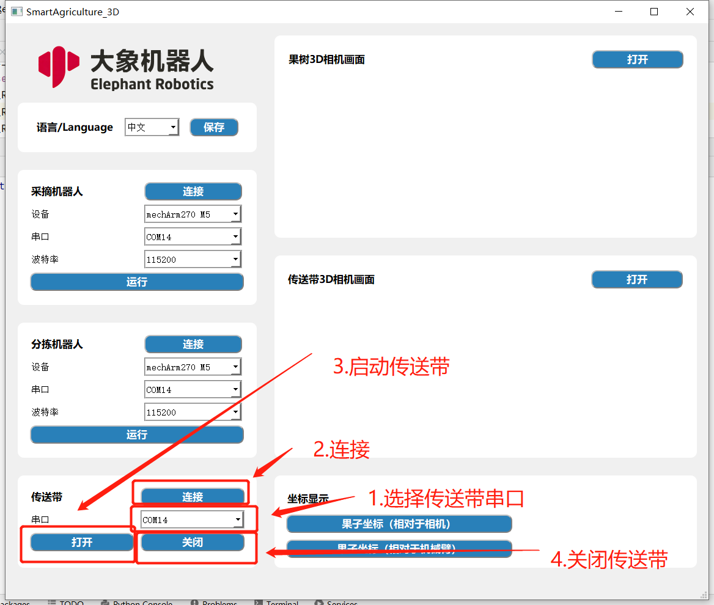
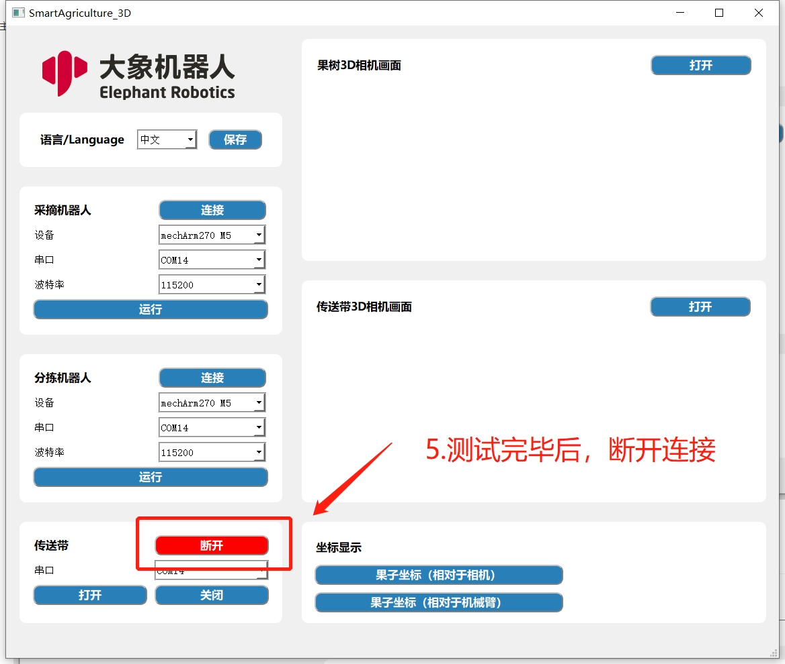
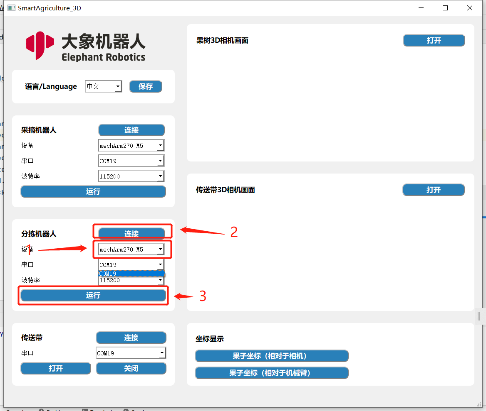
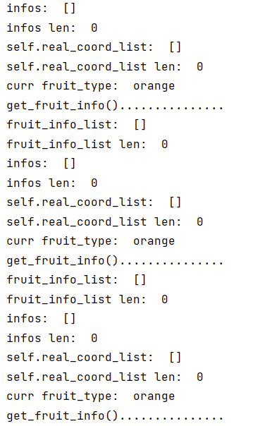
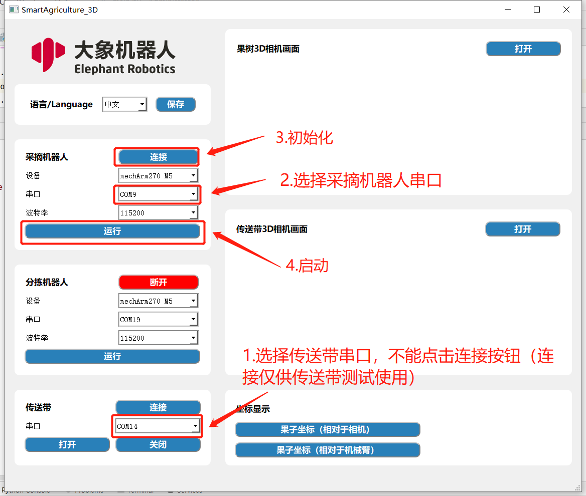
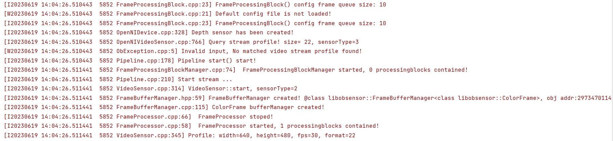
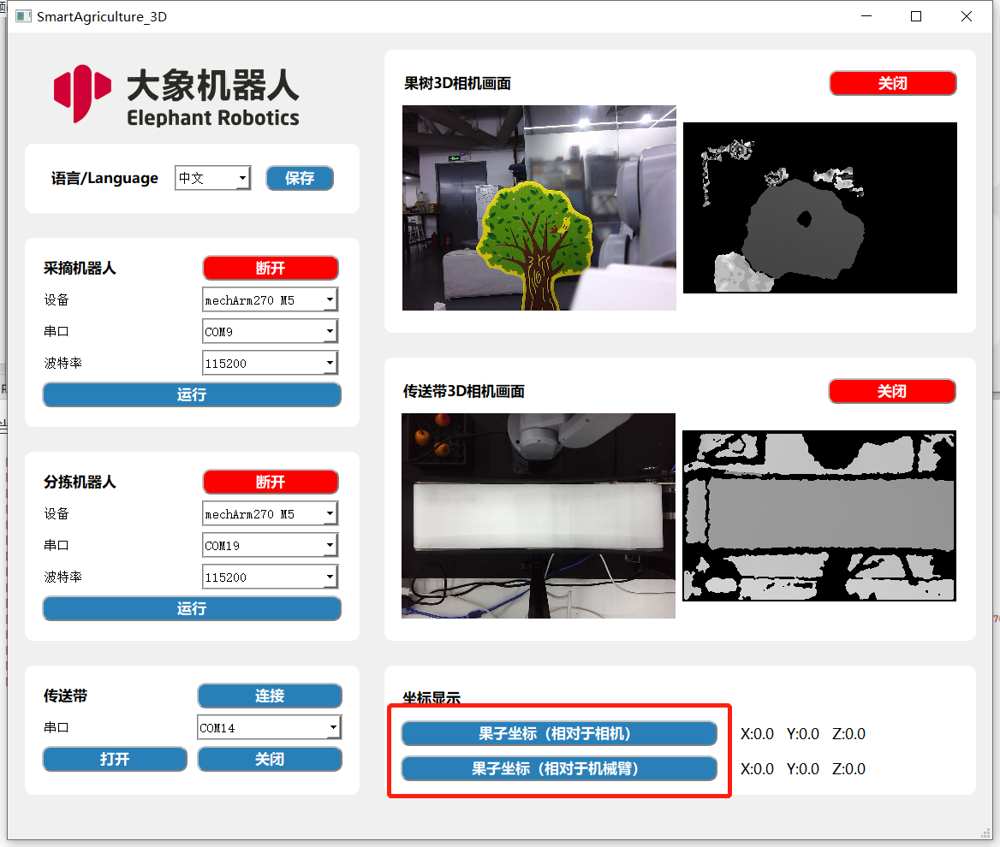

# GUI使用教程

## 1.传送带测试

## 2.连接分拣机器分拣机器人及相机

插上分拣机器人和传送带相机，选择串口，点击“连接”按钮进行初始化，然后点击运行启动。

## 2.启动采摘机器人及其相机

在分拣机器人及其相机启动后，启动标识：有一堆如下图所示的信息出现在终端。

连接采摘机器人、传送带及果树3D相机

当终端出现以下信息后，表示果树3D相机启动成功，即可实现自动采摘分拣。

选择相机打开按钮即可显示当前相机画面。

点击下方果子坐标显示按钮即可查看当前果子的位置信息
